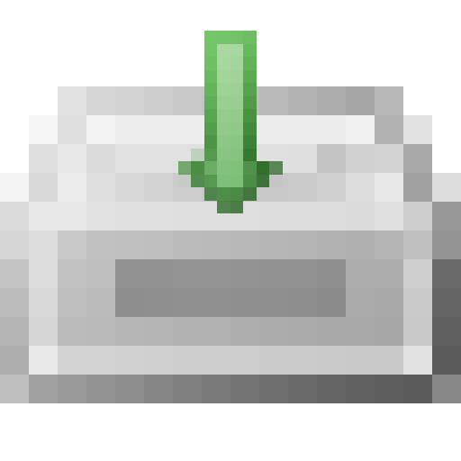

# Roblox Asset Downloader
### Version 1.0a
Originally scripted by SkylarZYX

It downloads, gathers, and saves asset data from a list of assetdelivery URLs (from a specified text file) to your computer. It's quite useful for trying to preserve your cloud saved assets locally on a project.
Locally saved assets can also be accessed in studio by copying and pasting the gathered assets you have into the "contents" folder. Using "rbxasset://" as the content folder path.

Highly recommend using [Roblox Studio Mod Manager](https://github.com/MaximumADHD/Roblox-Studio-Mod-Manager) so Roblox doesn't replace your local assets each time it updates. It makes using local assets a lot easier.

The Roblox plugin is for easily selecting assets in your explorer, then gathering asset ids and converting them into asset delivery URLs. They can be used in your browser, this highly recommended asset downloader program, or wget.
I plan on adding additional features for converting local to cloud asset paths or cloud to local asset paths in the future. (hopefully)

## Usage
`lune run astDL -- key.txt astUrls.txt [optional args: --outDir specificDirectory --spVer (number)]`

# Dependencies
### [Lune (v0.8.6+)](https://github.com/lune-org/lune)

Plugin dependency: [Roblox Studio](https://create.roblox.com/)

# Setup
If you're on Windows, simply click on install.bat, and it will install it for you.

If you're on Mac, you'll have to find a way to move the plugin script to your local roblox plugin path, sorry (not familiar with Macs) :(

# Credits
### rbxdl by Modnark (for inspiring me to make this, and giving me the proper assetType table)
https://github.com/Modnark/rbxdl

### FAMFAMFAM Silk Icons
https://github.com/markjames/famfamfam-silk-icons